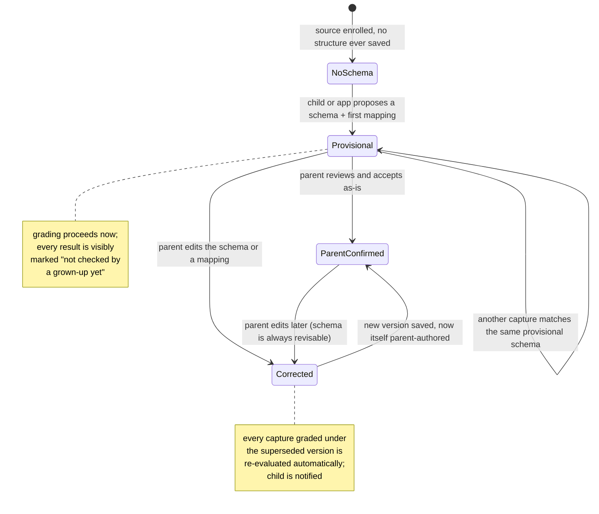
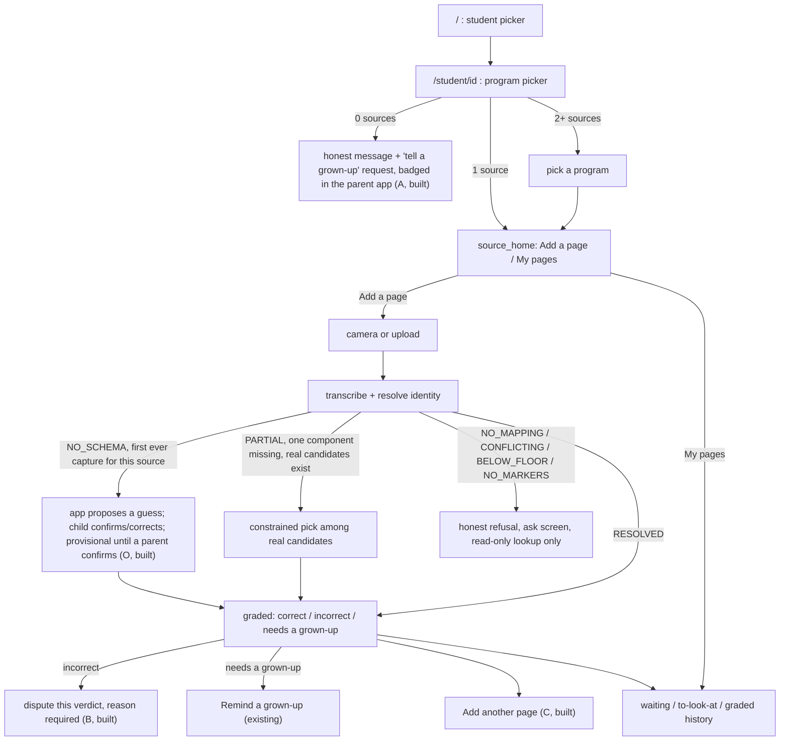
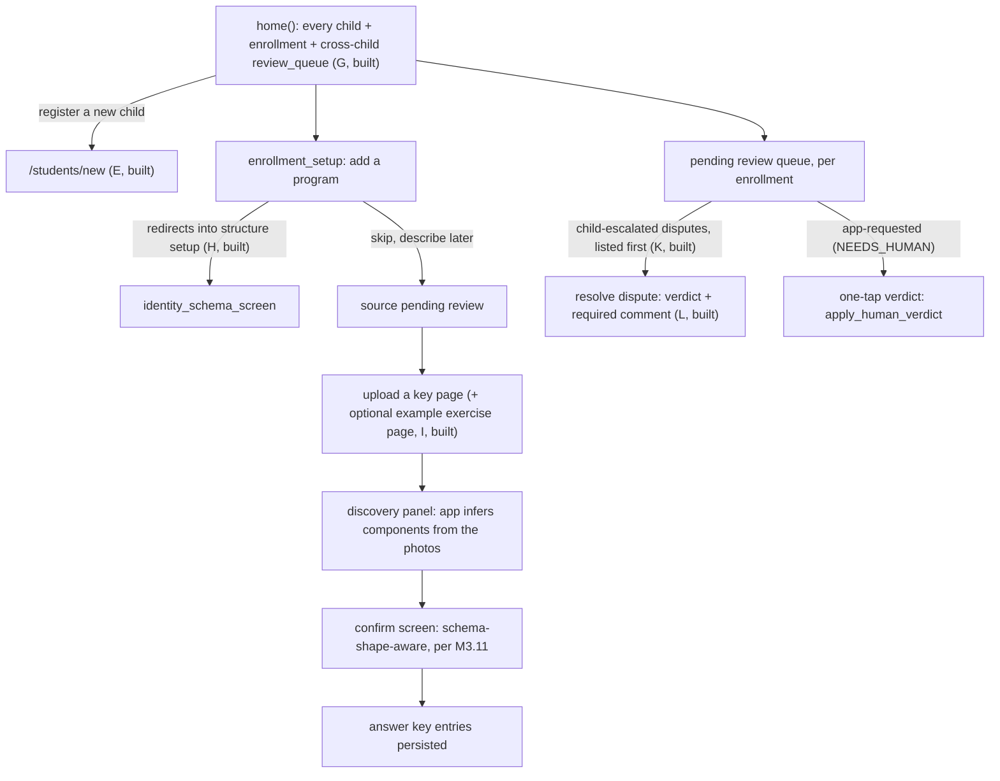
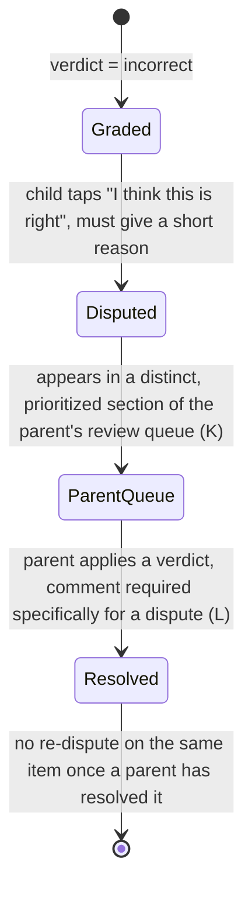

# User workflows: child and parent, end to end

## 0. Purpose and how to read this

This is the authoritative, implementation-grade description of every child-facing
and parent-facing flow in this system, including corner cases, states, and
transitions — precise enough that a person or another LLM can pick up any piece of
it and implement it correctly without re-deriving decisions already made. It does
not replace `docs/ARCHITECTURE.md` (system shape, module boundaries, the
confidence/escalation philosophy this whole document leans on) or `docs/ROADMAP.md`
(milestone sequencing and the gap register this document extends) — read this
alongside them, not instead of them.

**Tags used throughout:**
- **[BUILT]** — exists in the code today. Cited to the file/function that proves it,
  verified by reading that code while writing this document on 2026-08-30. Treat the
  claim as stale the instant that reference no longer matches the code — that is this
  repo's own stated norm for memory and documentation alike, and it applies here too.
- **[GAP <letter>]** — does not exist yet. Cross-referenced to `docs/ROADMAP.md`'s
  gap register (`A`–`L`), extended by this document with `M`–`O`.
- **[NEW]** — a design decision or corner case surfaced for the first time in this
  document, not previously written down anywhere else.

## 1. Actors

| Actor | App | Auth | Notes |
|---|---|---|---|
| Child | `k12ta.web`, port 8080 | none | No login, no PIN. A per-child PIN is a named, explicitly deferred P2 item (`docs/ROADMAP.md`), not built. |
| Parent | `k12ta.keys`, port 8082 | none for most actions; a PIN gates exactly one thing | The PIN (`k12ta.domain.policy` override) gates overriding feedback policy only — it is not a login. `k12ta.keys` is a fully separate process from `k12ta.web`, structurally unreachable from the child's flow (`docs/ARCHITECTURE.md`'s module table). |
| System | both apps + `k12ta.store`, `k12ta.grading`, `k12ta.pipeline` | — | Deterministic where it can be; never asked to invent a fact it can't verify. |
| Model | Gemini, via `k12ta.llm` | — | Every stage it feeds emits a confidence; anything below floor short-circuits to `NEEDS_HUMAN`, never a guess presented as fact (`docs/ARCHITECTURE.md`, "Confidence and escalation"). |
| Evaluator agent | `k12ta.grading`, via `k12ta.llm` | — | Judges any answer determinism can't settle — prose, open-ended, matching, a keyed mismatch, a keyless page with no key at all — reasoning about the answer whatever shape it takes. **Never branches on a kind of answer** (`docs/ARCHITECTURE.md`, "No answer-type enumeration"). Every keyless INCORRECT reaches a parent before the child, regardless of confidence, until family 3's precision number justifies otherwise. |

## 2. Core entities

| Entity | What it is | Store module |
|---|---|---|
| Student | One child | `k12ta.store.students` |
| Content source ("enrollment") | One program for one child, e.g. "Jahnvi / RSM Pre-Algebra Advanced". Carries **keyed vs keyless** (declared by the parent at setup, switchable later, never retroactively regrading), the feedback policy that decides what a child is told on attempts 2–3, and an **archived** flag (no new child uploads; everything already evaluated stays visible; the parent's review queue stays workable) | `k12ta.store.content` |
| Page identity schema | Versioned, ordered list of named components (`SchemaComponent`: `component_name`/`label`/`example`/`position`); exactly one version is "current" per source | `k12ta.store.page_identity_schemas` |
| Page identity mapping | A confirmed `composite_key -> page_number` row, tagged with provenance | `k12ta.store.page_identities` |
| Answer key entry | The graded truth for one `(page_number, problem_id)` | `k12ta.store.answer_keys` |
| Page capture | One photograph, one `capture_id` | `k12ta.store.captures` |
| Problem | One transcribed item on a capture | `k12ta.store.captures` |
| Graded problem | One problem's outcome: `answered` (bool) + `verdict` (`correct` / `partially_correct` / `incorrect` / `needs_human`, + cause). **`partially_correct` and `answered` added by the 2026-08-30 V1 clarification** — see `docs/ROADMAP.md`'s V1 definition. A multi-part question (a six-pair matching exercise, a seven-blank fill-in) is split into sub-items by the evaluator agent, one row each; `partially_correct` is for genuinely unsplittable partial work, such as a half-right prose answer | `k12ta.store.sessions` |
| Session | One capture's grading run; groups `graded_problems` for rendering | `k12ta.store.sessions` |
| Dispute | A child's contest of a verdict | **[BUILT]** `k12ta.store.disputes` |

`page_identities.source` today takes four values **[BUILT]** (`k12ta.store.page_identities.PageIdentityRow`):
`"model"` (parent confirmed the transcriber's value unchanged), `"manual"` (parent
typed/corrected it), `"backfill"` (mechanically re-expressed under a new schema
version, nothing freshly extracted), and, as of Gap O, `"unconfirmed"` (a child
confirmed the app's own guess, no parent involved yet). Built as one value, not
the two ("child_guess"/"app_guess") originally sketched here: nothing downstream
ever needed to tell "the child typed this" apart from "the app suggested it and
the child accepted it unchanged" — both mean exactly the same thing operationally
(not yet parent-reviewed), so building two would have been state nothing reads.

## 3. The identity trust model: schema provenance and authority

This section resolves the open design question from the workflow-critique
conversation: who may propose a program's structure, and what happens when they
disagree.

### 3.1 The rule, stated once

> **The child or the app may propose a structure. Only a parent may make it
> authoritative.** A proposal that hasn't been reviewed still works — grading
> proceeds against it — but every result produced under it is visibly marked as
> provisional until a parent confirms it. If a parent later corrects it, every
> page graded under the superseded version is automatically re-evaluated, and the
> child is told that happened.

### 3.2 Why this is safe precisely where it applies, and must not go further

The one thing that makes a wrong guess dangerous elsewhere in this system is a
**confident wrong grade**: a real answer key already exists for some page, and a
wrong page-identity match silently grades a child's work against the wrong page's
answers. `docs/ARCHITECTURE.md`'s "Asking when exactly one component is missing"
section is built entirely around avoiding exactly that outcome, and explicitly
warns against widening that exception past its original narrow scope.

The bootstrap case is different in one load-bearing way: **it can only ever occur
when `NO_SCHEMA`** — no schema has ever been saved for this source
(`page_identity_schemas.get_current_version` returns `0`). If no schema exists,
no `page_identities` mapping exists, which means no `answer_key_entries` can be
addressed by page number for this source yet either. The worst case of a wrong
guess here is not a confident wrong grade — it is an honest
`NEEDS_HUMAN(NO_KEY_FOR_PAGE)` **[BUILT]**, the same harmless outcome every page
without a key produces today. There is nothing yet for a wrong guess to collide
with.

This is exactly why the mechanism below **must not** extend to the `NO_MAPPING`
outcome under an *already-established* schema (a schema exists, has confirmed
mappings, and quite possibly a populated key — this composite specifically was
never confirmed). There, a wrong guess really can land on someone else's real,
keyed page and produce a confidently wrong grade. `NO_MAPPING` keeps behaving
exactly as it does today **[BUILT]**: the ask-flow is read-only, it never mints
(`k12ta.web.app.preview_page_entry` / `k12ta.keys.app.preview_page_entry`, both
converted to read-only lookups in the M3.11 identity-generalization pass); a
parent teaches a new mapping only through the manual-mapping screen. Do not
generalize "the child/app may guess" beyond `NO_SCHEMA` — that boundary is the
entire safety argument.

### 3.3 State machine

### 3.4 What each transition requires, concretely

| Transition | Mechanism | Status |
|---|---|---|
| `NoSchema -> Provisional` | `k12ta.web.app._resolve_pending_identities` detects a `NO_SCHEMA` capture with a stored guess and renders `SchemaGuessAsk`; `submit_schema_guess` saves what the child confirms/corrects. Not an extension of the parent-side key-scan discovery panel (`k12ta.keys.app._discover_identity_components`) — a separate, analogous mechanism on the child side, since the two apps share no route-level code. | **[BUILT]** |
| Recording a provisional schema | `page_identity_schemas.provenance` (migration 0023): `"parent"` (default, every pre-existing row) or `"unconfirmed"` — one value, not the two ("child_guess"/"app_guess") originally sketched, for the same reason `page_identities.source` collapsed to one: nothing needs the distinction. | **[BUILT]** `page_identity_schemas.save_new_schema`'s `provenance` parameter, `get_current_schema_provenance`, `confirm_current_schema` |
| Recording a provisional mapping | `page_identities.source = "unconfirmed"` — the column was already free text, no schema change needed, just a new literal value. | **[BUILT]** |
| Marking a result as provisional to the child | `session_result.html` / `my_pages.html` show "first guess — a grown-up hasn't checked this yet" whenever `get_current_schema_provenance(...)` isn't `"parent"` — a single source-wide banner, not a per-row badge (see §3.2: bootstrapping only ever produces version 1, so "current version's provenance" is exactly correct, never imprecise, for as long as it stays unconfirmed). | **[BUILT]** |
| `Provisional -> ParentConfirmed` | No separate review screen was built — the *existing* `k12ta.keys.app.identity_schema_screen` gained a banner, and its existing Save button, submitted with the form unchanged, now flips provenance via `confirm_current_schema`. Simpler than the two-screen design originally sketched, once building it revealed nothing else needed a distinct action. | **[BUILT]** |
| `Provisional -> Corrected` / `ParentConfirmed -> Corrected` | `save_new_schema` already creates a new version without touching the old one **[BUILT]**; `count_stale_for_source` already detects mappings confirmed under an older version **[BUILT]**. `submit_identity_schema` now captures the *old* version's provenance before overwriting it, to decide whether this Save is a correction of a provisional guess (§6.1 step 5) or an ordinary later edit (§6.5, unaffected). | **[BUILT]** |
| Regrade every affected capture | `k12ta.pipeline.process.replay_source` already did exactly this re-decision, source-wide, zero model calls — `submit_identity_schema` now calls it automatically for exactly one trigger: correcting a schema whose old provenance wasn't `"parent"`. Every other caller of a regrade in this app still triggers it by hand. | **[BUILT]** |
| Notify the child | `k12ta.store.identity_corrections` (migration 0023): one unacknowledged-notice row per (student, source), set by the correction above, shown on `source_home.html` with a "Got it" dismiss that deletes it — same in-app-only honesty as Gap A, same spirit as M5's "a correction never silently changes what the child already saw." | **[BUILT]** |

### 3.5 Why this does not change the existing, deliberate "regrade is manual" rule

`k12ta.keys.app.submit_regrade_pending`'s own docstring states the existing
principle plainly: re-grading days-old work the instant a key is added "was
explicitly the wrong trade: a parent should see what would now be gradable and
choose to trigger it." That principle is correct and this document does not
change it for the general case — **fixing a typo in an already-confirmed answer
key still does not auto-regrade** (see 6.5). The provisional-schema case is
different in kind, not just in degree: closing that loop is the fulfillment of a
promise already made to the child the moment a provisional result was shown to
her ("this hasn't been checked yet") — not a silent background change to work she
believed was already settled. The automatic behavior applies to exactly one
trigger — a parent's first correction/confirmation of a schema version whose
provenance is not `"parent"` — and nowhere else.

## 4. Child app flow (`k12ta.web`, port 8080)

### 4.1 Step by step, with corner cases

**1. Open the app.** `GET /` distinguishes 0 students (nobody set up yet) from 2+
(pick one) **[BUILT]**. It does *not* branch on "no programs" — that split happens
one tap later, at `GET /student/{id}` (`program_picker`) **[BUILT]**, per the
roadmap's own gap audit.

| Corner case | Behavior |
|---|---|
| Zero students exist at all | `/` shows an honest empty state; this is a parent-setup problem, not a child-facing gap. |
| A student exists but has zero sources | `program_picker` shows an honest message *and* a request the parent app badges on its landing page (`program_requests`, migration 0021, `submit_program_request`). **[BUILT]**, Gap A — deliberately scoped to an in-app flag only; real push/email/SMS stays explicitly deferred (§8). |
| Shared device, wrong child selected | No authentication exists to catch this (`AGENTS.md` rule 8, deliberate for v1). Work gets attributed to the wrong student until someone notices. Named risk, not solved here; the only mitigation on the roadmap is the P2 per-child-PIN item, explicitly deferred. |

**2. Pick a program.** `source_home.html`: "Add a page" or "My pages", with a
live "N waiting on a grown-up" badge **[BUILT]**.

**3. Add a page: camera or upload.** `_photo_source.html` supports both on both
platforms **[BUILT]**.

| Corner case | Behavior |
|---|---|
| Blurry or too-dark photo | Rejected by the capture-quality gate (aspect ratio + brightness heuristic, `k12ta.ingest.capture`) before any model call. **[BUILT]** |
| HEIC photo (default iPhone/iPad format) | Decoded via `pillow_heif`'s registered opener; re-encoded to JPEG on disk like any other capture. **[BUILT]** |
| A photo of something that isn't homework at all | Falls through to `NO_MARKERS`/zero transcribed problems; presented as "I couldn't read this one clearly," never as an error. **[BUILT]**, though the message doesn't specifically suggest "wrong program?" — a minor, unscoped wording nuance, not filed as its own gap. |
| Photo belongs to a *different enrolled program* than the one currently selected | Identity resolution runs only against the selected source's current schema; markers won't match its component shape, so this fails closed the same way a genuinely unreadable photo would (`NO_MARKERS`/`CONFLICTING`). No cross-program suggestion exists. Same minor wording nuance as above. |
| Double-tap submit (accidental double submission) | **Corrected 2026-08-30 — already built, not a gap.** `_capture_checklist.html`'s `input` "change" handler hides the take-photo button and disables the file input *before* the `fetch()` call goes out, on both the capture and retake paths — a second tap has nothing left to act on until the request settles (re-enabled only in the network-failure `catch`, never on success). Verified by reading the code before implementing anything here — see §7's note on Gap N. |
| Network drop mid-upload | Ordinary HTTP failure surfaces in the browser; no resumable-upload machinery. Acceptable for a single-household tablet-browser client; the fix is "tap again," not a new mechanism. Not filed as a gap. |
| Daily API quota already exhausted (`k12ta.pipeline`'s persisted `daily_request_counts` gate) | The pipeline refuses *before* ever calling the model, not after a failed call — an honest "try again later," never a raw error or a hang. **[BUILT]** |

**4. Transcription and identity resolution.** Seven outcomes
(`k12ta.grading.page_identity.PageIdentityOutcome`), all schema-shape-generic as
of the M3.11 identity-generalization pass **[BUILT]**:

| Outcome | Child sees | Notes |
|---|---|---|
| `NO_SCHEMA` | The bootstrap-guess flow: the app offers whatever identifier-like markers it found, the child confirms or corrects them, and grading proceeds against the resulting *provisional* schema, visibly marked unchecked until a parent confirms it. | **[BUILT]**, Gap O — see §3 and §6.1. Never a silent guess: it is only ever safe here because `NO_SCHEMA` implies no key can be addressed yet (§3.2). |
| `CONFLICTING` | Honest refusal — the photo's own markers don't agree with each other. | **[BUILT]** |
| `NO_MARKERS` | Honest refusal — nothing matching the schema was found at all. | **[BUILT]** |
| `PARTIAL` | Either a constrained pick among real, already-confirmed candidates (when exactly one component is missing and coverage allows it), or an honest refusal otherwise. | **[BUILT]**, `resolve_partial`, narrow and deliberate — see `docs/ARCHITECTURE.md` §"Asking when exactly one component is missing." |
| `BELOW_FLOOR` | Honest refusal — schema matched, confidence didn't clear the floor. | **[BUILT]** |
| `NO_MAPPING` | Schema-shaped ask screen, one field per component, **read-only lookup only** — never mints a new mapping. | **[BUILT]** as of M3.11; a parent must use the manual-mapping screen to teach a new composite. |
| `RESOLVED` | Falls through to grading. | **[BUILT]** |

**5. Results screen** (`session_result.html`, built from `StudentResultView` /
`summarize_results`) **[BUILT]**: correct / incorrect / needs-a-grown-up, visually
distinct per row, pooled into one "to look at" tally.

| Corner case | Behavior |
|---|---|
| Result graded against a still-provisional (not parent-confirmed) identity | Shows a source-wide "first guess — a grown-up hasn't checked this yet" notice whenever `get_current_schema_provenance(...)` isn't `"parent"`. **[BUILT]**, Gap O, per §3.4. |
| Second (or later) genuine guess at the same problem | Oracle suppression (`k12ta.domain.attempts.already_disclosed`) already prevents confirming/denying in a way that would leak the answer via retry-until-right — wired into `k12ta.respond.render` **[BUILT]**. The UI does not explicitly tell the child "this is a repeat attempt, that's why the feedback looks different" — a child could read suppressed feedback as a bug rather than a deliberate safety behavior. Not filed as a gap in the roadmap; worth a UI-copy fix whenever the results screen gets touched. |
| Child disputes an "incorrect" verdict | `_dispute_control.html` → `submit_dispute`; a short typed reason is required. **[BUILT]**, Gap B — see §6.3 for the full lifecycle. |
| "Remind a grown-up" on a row that's merely `NEEDS_HUMAN` | **[BUILT]** (`submit_reminder`, `request_reminder`) — sets a flag the parent app shows as a badge; re-tapping just overwrites the timestamp, no "already reminded" state to protect. Distinct from a dispute: a reminder means "this is stuck, please look," never "I think the grade is wrong" — the grader never called a verdict on a reminder-eligible row in the first place. |
| Navigate to submit another page | A link back into the capture flow from `session_result.html`. **[BUILT]**, Gap C. |

**6. My Pages / history** (`my_pages.html`) **[BUILT]**: waiting-on-a-grown-up /
to-look-at / graded, three-way split, built from `list_all_graded_for_source` +
`list_graded_attempts_for_source`.

| Corner case | Behavior |
|---|---|
| Child re-photographs a page whose problems already carry a decisive verdict | **Answer-safety is already correct** — oracle suppression works at the (page_number, problem_id) level regardless of how many captures produced attempts at it, because `k12ta.domain.attempts.attempt_number` counts genuinely distinct answers across every past capture, not per-capture. **But the listing itself does not group by (page_number, problem_id)** — `my_pages`'s `items` list is built one row per `(session, capture, problem)` from `list_all_graded_for_source`, with no dedup analogous to the parent app's `_pick_capture_for_page`/`capture_has_decisive_outcome`. A child who retakes the same page sees what looks like two separate homework items for the same question, sorted by problem id rather than by when each was taken. Confusing UX layered on top of correct underlying logic. **Closed** — `my_pages()` now groups by `(page_number, problem_id)` and shows `MyPageItem.attempt_count`. **[BUILT]**, Gap M. |
| A schema correction retroactively re-grades old captures (§3.4/§6.1) | The affected rows update in place (`update_graded_problem_after_identity_resolution`, never a new row) **[BUILT]**, so this doesn't create new duplicate-looking rows — it changes existing ones. The child is told: `identity_corrections` leaves a "Got it" notice on `source_home.html`. **[BUILT]**, Gap O, same as §3.4's notification row. |

## 5. Parent app flow (`k12ta.keys`, port 8082)

### 5.1 Step by step, with corner cases

**1. Landing page** (`home()`/`home.html`) **[BUILT]**: every child and their
enrollments.

| Corner case | Behavior |
|---|---|
| Registering a new child | `/students/new` in `k12ta.keys.app` — no longer requires running `scripts/seed_dev_data.py` by hand. **[BUILT]**, Gap E. |
| A parent wants one glance across every child/program before drilling in | `home()`'s `review_queue` rolls `list_pending_for_source` up across every child and enrollment. **[BUILT]**, Gap G. |

**2. Enroll in a program** (`submit_enrollment_setup`) **[BUILT]**.

| Corner case | Behavior |
|---|---|
| Describing structure at the same time as enrolling | One flow — `submit_enrollment_setup` now redirects into `identity-schema`. Still skippable (a parent can leave and describe structure later, or never, in which case §6.1's bootstrap covers it), but it is no longer a separately-discovered screen. **[BUILT]**, Gap H. |
| Describing structure from one example exercise page *and* one example key page together | An optional second photo on the `k12ta.keys` upload, merged via `discover_identity_from_example_page` (`k12ta.pipeline.key_ingestion`). **[BUILT]**, Gap I. |
| A natural-language, conversational assistant for the parent | **Now `docs/ROADMAP.md`'s M8, with four hard constraints added 2026-08-30: (1) confirm before save, always — a chat turn proposes, the parent confirms against the same preview the form paths show, never a one-message commit; (2) it may not mint page-identity mappings, since §3.2's safety argument depends on guessing staying confined to the `NO_SCHEMA` bootstrap; (3) it cannot bypass the parent PIN on a policy override; (4) its own prompt and its own eval — `coach_voice.md` is not reusable.** Does not exist anywhere; `k12ta.llm.gemini_chat`/`coach_voice.md` is wired only into the M3.3 integrity-eval harness, no live route, and that prompt is not reusable here regardless — it's built for child-facing Socratic tutoring under leakage rules that don't apply. **[GAP J]** — explicitly reprioritized 2026-08-30 to **P1**, then **broadened 2026-08-30** to two jobs, both parent-facing only, both text-based for now (no voice, no child-facing surface): (a) describing a program's structure conversationally instead of via forms — the original scope, precisely because natural language is a materially easier way to describe an arbitrary structure than any form-based schema editor ever will be — and (b) walking through evaluation review conversationally instead of `evaluations.html`'s button UI (confirming a low-confidence read, resolving a verdict, an override), a natural-language front end onto M5's correction loop. Both additive alongside the existing forms/buttons, not a replacement. It remains sequenced after **H**/**I** (needs something concrete to converse about for the setup half — done), and **[GAP O]**'s child/app-guess bootstrap (§3) covers a real slice of J's original value without a chat interface at all — J's remaining scope is "describe structure, and review evaluations, conversationally instead of via forms/buttons," not "make either possible at all." |

**3. Upload and confirm a key page** (`submit_upload`, discovery panel,
`submit_confirm`) **[BUILT]**, fully schema-shape-generic as of M3.11.

| Corner case | Behavior |
|---|---|
| Two rows share the same printed page value but different chapter/section values | Land in different stored `page_number`s via `resolve_or_assign_page_number`'s source-wide surrogate; re-confirming the same composite reuses the same surrogate. **[BUILT]**, the direct fix for the real RSM collision case. |
| A submitted bare `page_number` field once a schema has 2+ components | Ignored outright — no longer trusted as the join key past one component. **[BUILT]** |
| An incomplete composite (one component left blank) | Skipped silently, same honesty as any other refusal in this system. **[BUILT]** |

**4. Pending review queue** (`_group_pending_by_capture`, grouped by capture,
oldest first) **[BUILT]**.

| Corner case | Behavior |
|---|---|
| Several captures resolve to the same page | `_pick_capture_for_page` prefers the most recent capture with a real (correct/incorrect) verdict anywhere among its items over plain recency — found necessary 2026-08-22 when the newest of three page-15 captures had the worst transcription of the three. **[BUILT]** |
| A parent explicitly marks one capture a duplicate of another | `submit_mark_duplicate` / `_resolve_duplicate_root` follows the duplicate chain to its root, tolerant of cycles (stops the moment a revisit would occur). **[BUILT]** |
| Urgency/cause-based sorting within the queue | Child-escalated disputes now sort above everything else (a "disputed these" section in `evaluations.html`, above "Pending review"). **[BUILT]**, Gap K. *Within* each section it is still oldest-first, with no cause- or age-based ordering — the residual, unlettered half of K. |
| A parent's verdict needs to explain *why* to the child | A comment field exists and is **required** when resolving a dispute, shown back through `StudentResultView.dispute`. **[BUILT]**, Gap L. It stays *optional* — in practice, absent — on an ordinary `NEEDS_HUMAN` verdict; see `docs/ROADMAP.md`'s M5, where the child-notice bullet is scoped to exactly that remaining case. |
| Correcting an already-confirmed answer key entry | `upsert_entry`-style overwrite semantics let a parent resubmit and correct a wrong key value. **This does not auto-regrade** captures already graded against the old value — deliberately, per `submit_regrade_pending`'s own stated design (re-grading silently was "explicitly the wrong trade"). `replay_source` exists exactly for this — "re-run this after any key correction... in seconds" — but is a manual tool, not wired to fire automatically. Unchanged by this document; contrast with §3.5/§6.1, where automatic regrade is deliberately scoped to one specific, different trigger. |

**5. Regrading** (`submit_regrade_pending`, `replay_source`) **[BUILT]**: both
purely re-decide already-transcribed problems, zero model calls, zero quota
spent.

## 6. Cross-cutting flows

### 6.1 Bootstrap a brand-new program's structure **[BUILT 2026-08-30]**

As actually built, for a source with `NO_SCHEMA`:

1. A child photographs a page for a program nobody has described yet.
   `k12ta.pipeline.process.process_capture` still resolves this to
   `NEEDS_HUMAN(UNKNOWN_PAGE)` (grading itself never guesses) — but now also
   persists whatever the model's own extraction found
   (`result.page_identity.candidates`) in `page_identity_resolutions.
   seen_values_json`, the same field `PARTIAL_PAGE_MARKERS` already used for
   its own ask, reused here for a new purpose.
2. `k12ta.web.app._resolve_pending_identities` sees this capture's resolution
   outcome was `NO_SCHEMA` with something to offer, and renders a
   `SchemaGuessAsk` on `session_result.html` instead of a bare `PageNumberAsk`
   — one editable row per guessed component, pre-filled and checked, with an
   "uncheck if wrong" affordance per row.
3. The child confirms or corrects each field and submits
   (`POST /session/{student_id}/{session_id}/bootstrap-schema`,
   `k12ta.web.app.submit_schema_guess`). This is the one place in the whole
   app a schema is ever saved with `page_identity_schemas.save_new_schema(...,
   provenance="unconfirmed")` — version 1, since bootstrapping only ever
   fires on `NO_SCHEMA`. A first mapping is minted
   (`page_identities.resolve_or_assign_page_number`) and saved
   (`source="unconfirmed"`), and this one capture is regraded in place
   (`regrade_capture_for_resolved_identity`) — no re-transcription, no model
   call. A submission with nothing kept saves nothing; the ask reappears.
4. Grading proceeds immediately against this provisional schema for every
   future capture too — it is real enough to resolve identity, just not yet
   parent-reviewed. `session_result.html` and `my_pages.html` both show a
   "first guess — a grown-up hasn't checked this yet" notice whenever
   `page_identity_schemas.get_current_schema_provenance(...)` isn't
   `"parent"`.
5. Two ways forward, both through the *existing* `identity_schema_screen` /
   `submit_identity_schema` (no separate confirm screen was built — a banner
   plus the ordinary Save button turned out to be the whole action):
   - **Save unchanged** confirms it as-is: `page_identity_schemas.
     confirm_current_schema` flips provenance to `"parent"` in place, no new
     version, nothing to regrade (this capture already graded correctly).
   - **Save changed** is a correction: `save_new_schema(...,
     provenance="parent")` creates version 2; because version 1 was never
     trusted, `k12ta.pipeline.process.replay_source` fires automatically —
     the one regrade trigger in this entire app that isn't a parent
     separately choosing to click something — and
     `k12ta.store.identity_corrections.record_correction` leaves the child a
     notice, shown on `source_home.html` with a "Got it" dismiss.
     An ordinary edit to an *already* `"parent"` schema is unaffected: no
     auto-regrade, exactly as before this feature existed (§6.5).
6. If a second child capture arrives before any parent action, it resolves
   against the same provisional schema exactly like a normal
   `RESOLVED`/`PARTIAL` case would against a parent-authored one —
   provisionality is a property of the schema version, not of each
   individual capture. (If it too was captured before any schema existed and
   still carries its own `NO_SCHEMA` resolution, it will offer its own
   `SchemaGuessAsk` independently rather than detecting version 1 already
   exists — confirming it would create version 2 as an *additional*
   unconfirmed version, not a conflict or a wrong grade, since nothing has a
   key yet either way; a minor, accepted rough edge for the rare
   multiple-photos-before-any-confirmation case, not a safety concern.)

### 6.2 Re-scanning an already-submitted exercise page

Two genuinely different scenarios hide behind "rescanning," and they get
different treatment:

| Scenario | What happens today | Where |
|---|---|---|
| The child changed one answer and re-photographs the *whole page* | Every problem's answer is resubmitted; `_logical_attempt_count` (`k12ta.domain.attempts`) collapses an unchanged answer into the attempt it repeats — only the problem that actually changed counts as a new guess. Oracle suppression is correctly answer-safe. But `my_pages` shows a second, separate-looking row for every problem on the page, changed or not — closed by Gap M's grouping, see §4.1. | **[BUILT]** (safety and presentation alike) |
| The child re-submits the exact same physical page for no revision reason (retake, not a double-tap) | Two independent `page_captures` rows, graded independently, no child-visible sign they're the same page. A parent can clean this up manually (`submit_mark_duplicate`) after the fact. Genuinely accidental double-tap submission is already prevented client-side (see below) — this row is about a deliberate second photo of the same page, which nothing needs to prevent. | not a gap — cosmetic overlap with Gap M, already covered there |
| A page was `NEEDS_HUMAN` and a parent's later action resolves it (identity pick, key added, verdict applied) | Updates the *existing* `graded_problems` row in place — never inserts a new one, so this never produces a duplicate-looking row, and `k12ta.domain.attempts` keeps counting from the original capture's timestamp, not from when the regrade happened. | **[BUILT]** |

### 6.3 Dispute and escalation lifecycle **[BUILT 2026-08-30 — Gap B, K, L]**

Design agreed with the user during the workflow critique, then built exactly
as specified: `disputes` table (migration 0022), `k12ta.store.disputes`,
`k12ta.web.app.submit_dispute` (child side), `k12ta.keys.app.
submit_dispute_resolution` (parent side, `sessions.overturn_dispute_to_correct`
on an overturn).

Rules, exactly as agreed:
- Disputing requires the child to type a short reason — not a one-tap action (this
  makes disputing a deliberate act, not an easy way to route around an honest
  "incorrect").
- A parent's comment is required specifically when resolving a *dispute* (as
  opposed to an ordinary `NEEDS_HUMAN` verdict, where a comment stays optional).
- Once a parent resolves a dispute, the same item cannot be disputed again — the
  parent's word is final for that item.
- A dispute is structurally distinct from "Remind a grown-up": a reminder only
  ever appears on a row the grader itself refused to call (`NEEDS_HUMAN`); a
  dispute only ever appears on a row the grader *did* call, that the child
  believes is wrong.

### 6.4 Multi-attempt / oracle suppression

**As built:** `k12ta.domain.attempts` — zero I/O, two rules: `NEEDS_HUMAN` never counts as
an attempt (a blurry retake must be free), and a resubmission with an unchanged
answer is not a new attempt. `already_disclosed` goes true from the second
genuinely distinct guess onward, at which point confirm/deny responses must say
the same thing regardless of whether the new guess happens to be right — this is
what makes a wrong/wrong/right sequence non-revealing. **[BUILT]**, wired into
`k12ta.respond.render` for the live child-facing render and into `k12ta.keys.app`
for the parent-visible repeat count.

**Changed by the 2026-08-30 V1 clarification — `docs/ROADMAP.md`'s M7 builds this:**

- **A hard cap of three submissions per page**, which did not exist before.
- **A resubmission is only accepted if the child confirms she actually redid the work.**
  The app asks. An accidental re-upload of something already submitted — the real
  behaviour that produced three independent captures of page 15 in the live database — is
  caught rather than counted.
- **This retires the "unchanged answer isn't a new attempt" text comparison.** That rule
  was guesswork standing in for the child's intent, and it becomes actively unreliable
  once the evaluator describes answers in prose (two reads of one matching exercise won't
  produce byte-identical text). The child's own confirmation replaces it. `NEEDS_HUMAN`
  still never counts.
- **Every attempt is numbered and visible to both** child and parent — the history view
  §4.1 says doesn't exist scoped to "this page, every time."
- **The parent's most recent verdict is always final**, superseding the AI's call and any
  earlier attempt.
- **What the child is told on attempts 2 and 3 is now a per-program decision**, not a
  blanket suppression: work someone else grades → "submitted, a grown-up will look at
  this," no correct/incorrect; self-directed practice → full feedback every time. This
  comes from the feedback policy each program already carries, so it needs no new concept.
  Three attempts with live feedback on graded homework would be three free guesses at the
  oracle, which is why the split exists.

### 6.5 Answer-key correction after captures already graded against it

Unchanged by this document, stated here only to contrast with §3.5/§6.1: correcting
an already-confirmed key entry does not auto-regrade. `replay_source` exists and is
the right tool, but stays a deliberate, manually-triggered action
(`submit_regrade_pending` already covers the narrower "a key was added where none
existed" case automatically-on-request; a full source replay after an arbitrary key
edit is available but not wired to fire on its own). This is correct, existing
design, not a gap — do not conflate it with the automatic regrade that §3.4
deliberately adds for the one different, narrower trigger described there.

### 6.6 Quota exhaustion and transient failures

| Failure | Where it's caught | Child/parent sees |
|---|---|---|
| Daily Gemini quota already spent | `k12ta.pipeline`'s persisted `daily_request_counts` gate, checked before any model call | Honest "try again later," never a raw error |
| A single call gets rate-limited (`RateLimitExhaustedError`) | `k12ta.llm._gemini_http`, retried with backoff before surfacing | Same honest treatment, after retries are exhausted |
| The eval harness's own internal per-run safety cap (`RequestCapExceededError`) | `evals/integrity/` only — not a live-app failure mode at all, do not confuse with the above | N/A — dev/eval concern only |

### 6.7 Shared-device / wrong-student risk

No authentication exists in v1 (`AGENTS.md` rule 8, deliberate). A child who
starts a session as a different student attributes work to the wrong record with
no system-level way to catch it. The only mitigation on the roadmap is the P2
"per-child PIN" item, explicitly deferred and explicitly scoped to never become a
real login. Documented here as a standing, accepted risk, not solved by anything
in this document.

## 7. Gap register (extends `docs/ROADMAP.md`'s table)

| Gap | What | Depends on | Status |
|---|---|---|---|
| A | Child's empty-state "no programs" alerts the parent in-app; real email/text explicitly deferred | none | **Built 2026-08-30** — `program_requests` table/migration 0021, `k12ta.web.app.submit_program_request`, badge on `k12ta.keys` `home.html` |
| B | Child can dispute/escalate a verdict into its own parent-visible queue item | none | **Built 2026-08-30** — `disputes` table (migration 0022), `k12ta.store.disputes`, dispute button in `_dispute_control.html` |
| C | A link back to "add a page" from the results screen | none | **Built 2026-08-30** — `session_result.html` |
| E | Parent can register a new child from the web app | none | **Built 2026-08-30** — `/students/new` in `k12ta.keys.app` |
| F | Per-child performance dashboard | learning intelligence (V2) | **rescoped 2026-08-30**: mastery/skill-tagging moved out of V1 entirely (`docs/ROADMAP.md`'s M4 now lives under V2), so this gap no longer has a V1 milestone to depend on — it waits for V2, not "M4" specifically. A plain, mastery-free review-queue status view is V1 scope instead; see `docs/ROADMAP.md`'s "Parent surface: information architecture" item 1 |
| G | Cross-child/cross-program review queue on the landing page | none (pure aggregation) | **Built 2026-08-30** — `home()`'s `review_queue` in `k12ta.keys.app` |
| H | Enroll + describe structure as one flow | none | **Built 2026-08-30** — `submit_enrollment_setup` redirects into `identity-schema` |
| I | Combined example-exercise + example-key upload to bootstrap discovery | none structurally, bigger than H | **Built 2026-08-30** — optional second photo in `k12ta.keys` upload, merged via `discover_identity_from_example_page` (`k12ta.pipeline.key_ingestion`) |
| J | Conversational, parent-only, text-only assistant for structure setup *and* evaluation review | H, I, benefits from O existing first | **reprioritized 2026-08-30 to P1, broadened 2026-08-30** to include evaluation review, not just setup; not started; scope shrunk by O |
| K | Review queue: child-escalated items surfaced/prioritized above app-requested | B | **Built 2026-08-30** — "disputed these" section in `evaluations.html`, above "Pending review" |
| L | Parent's verdict can carry an optional comment shown to the child | B (for real payoff) | **Built 2026-08-30** — `resolve-dispute`'s required comment, shown back via `StudentResultView.dispute` |
| M | "My pages" doesn't group repeated captures of the same (page, problem) into one item with a visible attempt history | none | **Built 2026-08-30** — `MyPageItem.attempt_count`, grouping in `my_pages()` |
| N | ~~No automatic duplicate/double-submission guard~~ | — | **Corrected 2026-08-30: not a gap.** Already built (`_capture_checklist.html`'s disable-on-select guard); struck from the register. |
| O | Child/app can propose a brand-new program's structure when none exists yet; provisional until a parent confirms; a parent's correction auto-regrades affected pages and notifies the child | none structurally, but touches identity trust model (§3) | **Built 2026-08-30** — `provenance` column (migration 0023), `SchemaGuessAsk` in `k12ta.web.app`, confirm/correct in `k12ta.keys.app` (`replay_source` wired for exactly this trigger), `identity_corrections` notice |

**There is no gap D.** The letter was never assigned: `docs/ROADMAP.md`'s parent-app
audit item 4 (a per-child page listing enrollments only) was judged already satisfied
in spirit by the landing page and explicitly not filed as a gap. Recorded here so the
hole in the sequence reads as deliberate rather than as a lost row.

All five groups shipped 2026-08-30: Group 1 (C, A, M) → Group 2 (E, G) →
Group 3 (H, I) → Group 4 (B, K, L) → Group 5 (O). Two were excluded from that pass,
for different reasons and they are not the same kind of thing: **F is no longer V1
scope at all** (it needs the mastery layer, which the 2026-08-30 rescoping moved to
V2), and **J is the only gap from this critique still open inside V1** — its own
future milestone, at P1.

### 6.8 Keyed vs keyless: what a child sees when a page can't be evaluated

Added by the 2026-08-30 V1 clarification. The two paths fail differently on purpose, and
a child should never have to know which kind of program she is in to understand the
screen:

| | Keyed program | Keyless program |
|---|---|---|
| No key on file for this page | **Not evaluated at all.** "Waiting on a grown-up to add the answers." The parent is notified and the page waits — the system never invents an answer for a program whose parent said they have the answers. | n/a — there is never a key |
| The evaluator is confident and says correct | Shown to the child | Shown to the child |
| The evaluator says **incorrect** | Shown (a human authored the key) | **Goes to the parent first, every time, regardless of confidence**, until family 3's precision number exists. She sees "a grown-up is checking this," not "wrong." |
| The evaluator is unsure of the answer or of the OCR | Parent review queue, child sees "needs a grown-up" | Same |

The asymmetry in row three is deliberate and is the single most important safety rule in
V1: telling a child she is wrong on a model's unverified say-so is the confident-wrong-
grade failure this whole system exists to refuse.

## 8. Explicitly out of scope for this document

- Real push/email/SMS notification delivery — every "notify" mechanism above is
  scoped to an in-app flag, exactly as Gap A was originally scoped.
- Per-child authentication/PIN — P2, unchanged, referenced only as a risk mitigation
  that doesn't exist.
- Mastery-model-driven dashboards and scheduling (V2's M4, formerly slated for V1) —
  referenced only where a gap explicitly depends on it (Gap F).
- The M3.3 coach-voice prompt leaks (`salami_3`, `reverse_3`, the
  `confirmed_or_denied` refusal-phrasing false positives) — a separate, already-
  tracked thread in `docs/ROADMAP.md`'s M3 section, unrelated to these workflows.
